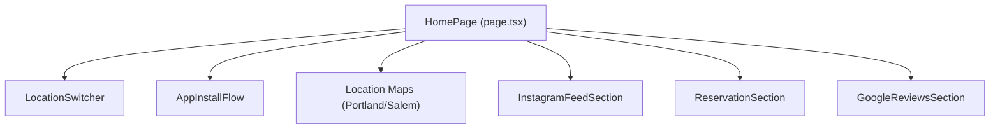
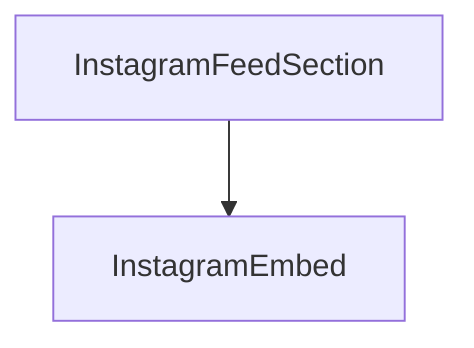
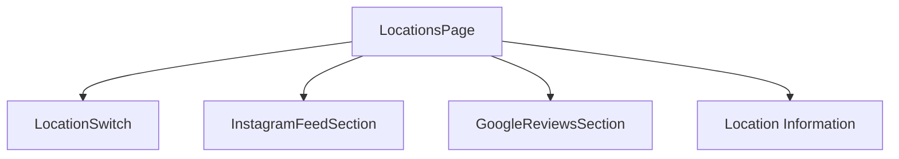
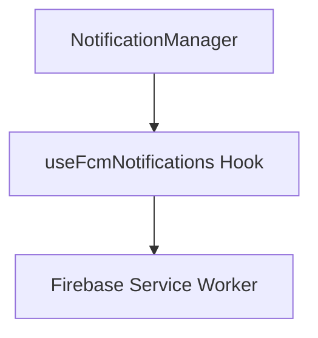
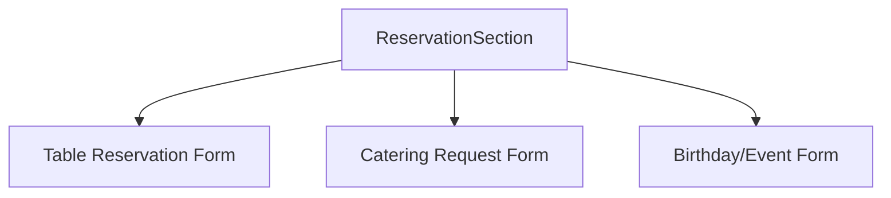

# Component Flow Documentation

This document outlines the main component relationships and flows in the Side Hustle Bar website after recent cleanup and optimization efforts.

## Homepage Component Flow



## Instagram Implementation

After cleanup, the Instagram implementation is now simplified:



Previous structure (removed):
```
ElfsightInstagramFeed → InstagramEmbed
SideHustleInstagramFeed → ElfsightWidget → ElfsightMock
SmartElfsightWidget → ElfsightWidget
```

## Locations Page Flow



## Push Notification System



## Reservation Flow



## Key Components and Their Purpose

| Component | Purpose | Location |
|-----------|---------|----------|
| `InstagramFeedSection` | Displays Instagram feed using official embed | `/src/components/features/social/InstagramFeedSection.tsx` |
| `InstagramEmbed` | Core implementation for Instagram embed | `/src/components/features/social/InstagramEmbed.tsx` |
| `ReservationSection` | Provides booking forms for tables/events | `/src/components/features/social/ReservationSection.tsx` |
| `GoogleReviewsSection` | Displays Google reviews | `/src/components/features/social/GoogleReviewsSection.tsx` |
| `LocationSwitcher` | Toggles between Portland and Salem locations | `/src/components/features/location-switcher.tsx` |
| `AppInstallFlow` | Manages PWA installation process | `/src/components/features/install/AppInstallFlow.tsx` |
| `NotificationManager` | Handles push notification registration | `/src/components/features/notifications/NotificationManager.tsx` |

## Rendering Order on Homepage

The components on the homepage are rendered in this order:

1. LocationSwitcher
2. Header content with chef photo
3. AppInstallFlow
4. Location Maps (Portland/Salem based on selection)
5. InstagramFeedSection
6. ReservationSection
7. GoogleReviewsSection